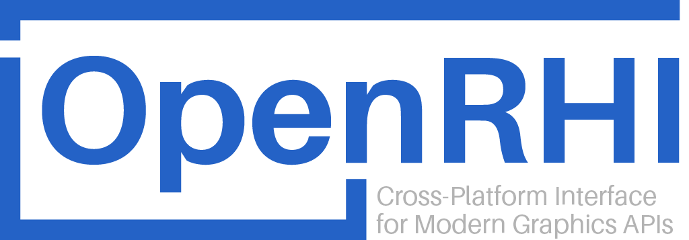

# OpenRHI

**OpenRHI** — *orhi* — is a lightweight, permissive, cross-platform **Render Hardware Interface** for modern graphics APIs, built with C++20.

Write hardware-agnostic graphics code once, and run it seamlessly across multiple platforms and graphics APIs.

**OpenRHI** is...
- 🧩 **Simple:** Easy to understand and extend
- ⚡ **Fast:** Minimal runtime overhead with template-based design
- ⛓️‍💥 **Standalone:** Zero external dependencies
- 📃 **Documented:** Comprehensive source code documentation
- 🌈 **Cross-platform:** Native support for Windows, macOS, and Linux
- ⚙️ **Build-ready:** Quick setup with [CMake](https://cmake.org/)

**Goals:**
- Provide a thin, explicit abstraction over modern graphics APIs
- Offer low-level access to each backend through a unified interface
- Maintain explicitness: no hidden logic or implicit behavior
- Ensure minimal runtime overhead with zero-cost abstractions
- Remain cross-platform and hardware-agnostic
- Maintain minimal external dependencies

**Non-Goals:**
- Hiding platform or API-specific implementation details
- Acting as a high-level rendering engine or framework
- Abstracting away or simplifying modern graphics concepts
- Automatically managing resources, pipelines, or synchronization

## Supported Graphics APIs

**OpenRHI** primarily targets **desktop platforms**, with an [API](include/orhi/api/) architecture designed for maximum flexibility to support any backend your application needs.

**Target platforms:** Windows (🪟), Linux (🐧), and macOS (🍎)

### Implementation Status
| Graphics API | Platforms | Status |
|-|-|-|
| Vulkan | 🪟🐧 | 🌓 Partial |
| DirectX 12 | 🪟 | ⌛ In Progress |
| Metal | 🍎 | ❓ TBD — Should we rely on [MoltenVK](https://github.com/KhronosGroup/MoltenVK) instead? |
| Mock (Headless) | 🪟🐧🍎 | 📅 Planned |
| OpenGL | 🪟🐧 | ☠️ Deprecated — Moved to [BareGL](https://github.com/adriengivry/baregl) |

> [!WARNING]
> **OpenRHI** is actively evolving as support for additional graphics backends is added. The [API](include/orhi/api/) may change to accommodate the unique requirements and design philosophies of each backend. Implementation details are also subject to refinement as the project works toward production-quality standards.

## Configuration
### Build Options
| Option | CMake Option | Allowed Values |
| - | - | - |
| Compile Vulkan backend | `ORHI_COMPILE_VULKAN` | - |
| Compile Mock backend | `ORHI_COMPILE_MOCK` | - |
| Generate examples | `ORHI_GENERATE_EXAMPLES` | - |
| Select the window system to use when compiling for linux or to use the headless mode | `ORHI_WINDOW_SYSTEM` | `xlib`&nbsp;(linux)<br>`xcb`&nbsp;(linux)<br>`wayland`&nbsp;(linux)<br>`none`&nbsp;(headless) |

> [!NOTE]
> **OpenRHI** currently builds only as a static library.

### Defines
| Option | C++ Define | Notes |
| - | - | - |
| Set Vulkan as the default backend | `ORHI_SELECT_VULKAN` | Must be defined before including any backend-agnostic header, e.g. `<orhi/device.h>` |
| Set Mock as the default backend | `ORHI_SELECT_MOCK` | Must be defined before including any backend-agnostic header, e.g. `<orhi/device.h>` |

## Multi-Backend Architecture
**OpenRHI** supports compiling with multiple graphics APIs simultaneously.

You can also choose which graphics API serves as the default backend for API-agnostic objects, while still having access to backend-specific implementations when needed.

### Using the Default Graphics API
```cpp
// Include the API-agnostic header
// Requires ORHI_SELECT_{API} to be defined
#include <orhi/Buffer.h>

// Create a buffer using your selected graphics API
// (e.g., Vulkan when ORHI_SELECT_VULKAN is defined)
orhi::Buffer buffer{};
```

### Using Specific Graphics APIs
```cpp
// Include Vulkan-specific headers
// Requires ORHI_COMPILE_VULKAN to be defined
#include <orhi/impl/vk/Buffer.h>

// Include Mock backend headers
// Requires ORHI_COMPILE_MOCK to be defined
#include <orhi/impl/mock/Buffer.h>

orhi::impl::vk::Buffer vulkanBuffer{};
orhi::impl::mock::Buffer mockBuffer{};
```

## Examples
**OpenRHI** comes with a set of [examples](examples/) for you to try.

## API Equivalence
| OpenRHI | Vulkan | DirectX 12 |
| - | - | - |
| `Instance` | `VkInstance` | - |
| `Device` | `VkDevice` | - |
| `SwapChain` | `VkSwapChain` | - |
| `Framebuffer` | `VkFramebuffer` | - |
| `Buffer` | `VkBuffer` | - |
| `Texture` | `VkImage` | - |
| `DescriptorPool` | `VkDescriptorPool` | - |
| `DescriptorSetLayout` | `VkDescriptorSetLayout` | - |
| `DescriptorSet` | `VkDescriptorSet` | - |
| `Descriptor` | `VkImageView`, `VkSampler` | - |
| `RenderPass` | `VkRenderPass` | - |
| `ShaderModule` | `VkShaderModule` | - |
| `PipelineLayout` | `VkPipelineLayout` | - |
| `Pipeline` | `VkPipeline` | - |
| `CommandPool` | `VkCommandPool` | - |
| `CommandBuffer` | `VkCommandBuffer` | - |
| `Queue` | `VkQueue` | - |
| `Fence` | `VkFence` | - |
| `Semaphore`| `VkSemaphore` | - |

## Contributing
All contributions to **OpenRHI** are welcome — from bug reports and feature suggestions to code improvements and documentation enhancements.

Feel free to open issues or submit pull requests for review. Every contribution helps make **OpenRHI** better!

For more information on contributing, check out [CONTRIBUTING.md](CONTRIBUTING.md).

*By contributing, you agree that your contributions will be licensed under the [MIT License](LICENSE).*


## License
**OpenRHI** is licensed under the [MIT License](LICENSE).

You are free to use, modify, and distribute this project with proper attribution. See the license file for more details.